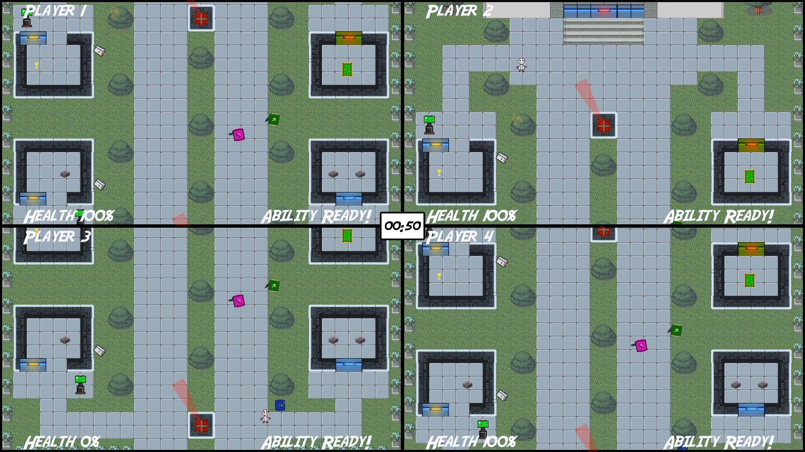

# Four Ferrets
## A four player splitscreen co-op game created in C++ with the ASGE library 

The largest project in my 3 piece 'More Games in C++' portfolio. Created in a group of four, Four Ferrets is a top down heist game where the players must work together as a team to steal a deadly bio-weapon. 

My main responsibilities in this project were the backend wrapper (eg scene/gameobject, thread and audio handling) and gameplay elements (eg security cameras, guards, players and pickups).  

Gameplay video: https://youtu.be/qYyY2g0wzvI &nbsp;- See the game in action!  
Deep dive video: https://youtu.be/ruUjcS7KBHQ - My thought process behind the code
